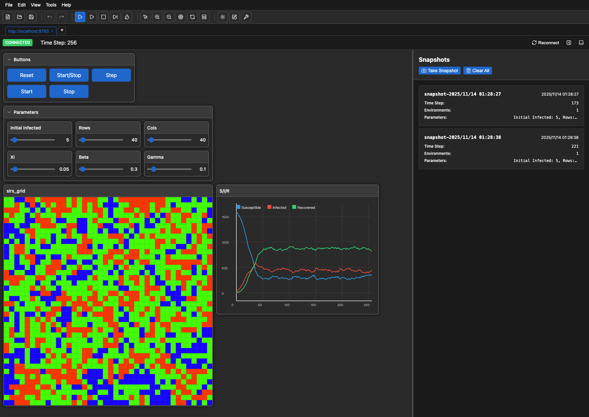

# TenSnap

**TenSnap** (short for "NetLogo Snapshot", with "Net" reversed) is an open-source interactive visualization toolkit for agent-based modeling and simulation (ABM&S). It combines NetLogo's immediacy in visualization with the flexibility and power of modern programming ecosystems.

## ✨ Features

- **🎨 Interactive Visualization**: Real-time visualization of agent-based simulations with immediate feedback
- **🌐 Language Agnostic**: Connect simulations written in any language (Python ready, Java/JavaScript/Go/MATLAB planned)
- **⚡ Modern Web Interface**: Built with React for a responsive, feature-rich user experience
- **🎛️ NetLogo-Inspired UI**: Familiar controls (sliders, buttons, charts) with modern enhancements
- **🔧 Multi-Granularity APIs**: From simple high-level APIs for beginners to low-level protocol access for experts
- **💻 Dual Deployment**: Run in browser or as desktop app via Tauri
- **🌍 Internationalization**: Full i18n support with English, Chinese, and Japanese languages



## 🚀 Quick Start

### Installation

Installing Python bindings from PyPI:

```bash
pip install tensnap
```

Installing Python bindings from source code (for advanced users):

```bash
# Clone the repository
git clone https://github.com/billstark001/tensnap.git
cd tensnap

# Install Python bindings
cd packages/tensnap-python
pip install -e .

```

Installing Node.js dependencies for frontend development (for advanced users):

```bash

# Install JavaScript dependencies
pnpm install
```

### Run Your First Example

```bash
# Start web interface (in one terminal)
pnpm dev:web

# Run flocking simulation (in another terminal)
pnpm dev:py:flock

# Or run directly from the examples directory
cd examples/python
python flock_viz.py
```

Then open your browser to `http://localhost:3200` and watch the agents interact!

- The [Netlify instance](https://tensnap.netlify.app) is also available at `https://tensnap.netlify.app`. You may access the site to avoid local deployment.

## 📚 Documentation

Comprehensive documentation is available in the `/docs` folder:

### For Users

- **[Getting Started](./docs/user-guide/getting-started.md)** - Quick introduction and first steps
- **[Installation Guide](./docs/user-guide/installation.md)** - Detailed installation instructions
- **[User Guide](./docs/user-guide/user-guide.md)** - Complete guide to using TenSnap
- **[Tutorials](./docs/tutorials/)** - Step-by-step tutorials and examples
- **[Python API Reference](./docs/api-reference/python-api.md)** - Complete Python API documentation

### For Maintainers

- **[Architecture Overview](./docs/maintainer-guide/architecture.md)** - System architecture and design
- **[Development Setup](./docs/maintainer-guide/development-setup.md)** - Setting up development environment
- **[Contributing Guidelines](./docs/maintainer-guide/contributing.md)** - How to contribute to TenSnap
- **[Protocol Documentation](./docs/maintainer-guide/protocol.md)** - WebSocket protocol specification
- **[Internationalization (i18n)](./docs/maintainer-guide/i18n.md)** - Translation and localization guide

## 🎯 Design Philosophy

TenSnap aims to:

1. **Preserve NetLogo's Strengths**: Keep the rapid prototyping and interactive visualization that made NetLogo popular
2. **Embrace Modern Ecosystems**: Allow researchers to use their preferred programming languages and tools
3. **Separate Concerns**: Decouple model logic (any language) from visualization (TenSnap)
4. **Support All Skill Levels**: Provide intuitive APIs for newcomers and powerful tools for experts

## 📖 Example

Here's a simple agent-based model with TenSnap:

```python
from tensnap import (
    SimulationScenario,
    GridEnvironmentBinder,
    bind_grid_agent,
    bind_grid_environment,
    chart,
    action,
)
from dataclasses import dataclass
import asyncio

@dataclass
class Config:
    num_agents: int = 50
    speed: float = 1.0

# Define agent with metadata binding
@bind_grid_agent(heading=True, color=True, size=True)
class Agent:
    color = "#3498db"
    size = 8
    
    def __init__(self, agent_id, x, y):
        self.id = agent_id
        self.x = x
        self.y = y
        self.heading = 0

# Define model with metadata binding
@bind_grid_environment()
class Model:
    def __init__(self, config):
        self.config = config
        self.agents = []
    
    @property
    def width(self): return 50
    
    @property
    def height(self): return 50
    
    def initialize(self):
        self.agents.clear()
        for i in range(self.config.num_agents):
            self.agents.append(Agent(f"agent_{i}", 25, 25))
    
    def step(self):
        # Your simulation logic here
        pass

# Setup scenario
config = Config()
model = Model(config)
scenario = SimulationScenario(port=8765)

# Add environment
grid = GridEnvironmentBinder(
    id="main",
    environment=model,
    agent_iterable_accessor='agents'
)
scenario.add_environment(grid)

# Add parameters and charts
scenario.add_parameters(config)

@chart("population", "Population", color="#3498db")
def track_population():
    return len(model.agents)

@action("reset", "Reset")
async def reset():
    model.initialize()

# Run simulation
async def main():
    model.initialize()
    scenario.add_charts(globals())
    scenario.add_actions(globals())
    await scenario.register_model_handler(model.initialize, model.step)
    await scenario.run()

if __name__ == "__main__":
    asyncio.run(main())
```

## 🏗️ Project Structure

TenSnap is organized as a monorepo:

```
tensnap/
├── packages/
│   ├── tensnap-python/          # Python bindings
│   ├── tensnap-web/             # Web frontend (React)
│   └── tensnap-tauri/           # Desktop app (Tauri)
└── docs/                        # Documentation
```

## 🤝 Contributing

We welcome contributions! Please see our [Contributing Guidelines](./docs/maintainer-guide/contributing.md) for details on:

- Reporting bugs
- Suggesting enhancements
- Submitting pull requests
- Code style and standards

## 📝 License

TenSnap is released under the [MIT License](./LICENSE).

## 🎓 Background

TenSnap was developed to address the gap between NetLogo's excellent interactive visualization and modern programming paradigms. While NetLogo excels at rapid prototyping and visualization, it lacks support for modern features like object-oriented programming, modularity, and asynchronous execution. TenSnap bridges this gap by:

- Providing NetLogo-style visualization for any programming language
- Supporting modern development practices
- Enabling scalable, industrial-strength simulations
- Maintaining the ease-of-use that makes NetLogo popular

## 🔗 Links

- **[Documentation](./docs/)** - Complete documentation
- **[Python Examples](./examples/python/)** - Standard Python examples
- **[Mesa Examples](./examples/python_mesa/)** - Mesa-based examples
- **[Issues](https://github.com/billstark001/tensnap/issues)** - Report bugs or request features
- **[Discussions](https://github.com/billstark001/tensnap/discussions)** - Ask questions and share ideas

## 🌟 Star History

If you find TenSnap useful, please consider giving it a star on GitHub!

---

**TenSnap** - Interactive visualization for agent-based modeling, reimagined.
