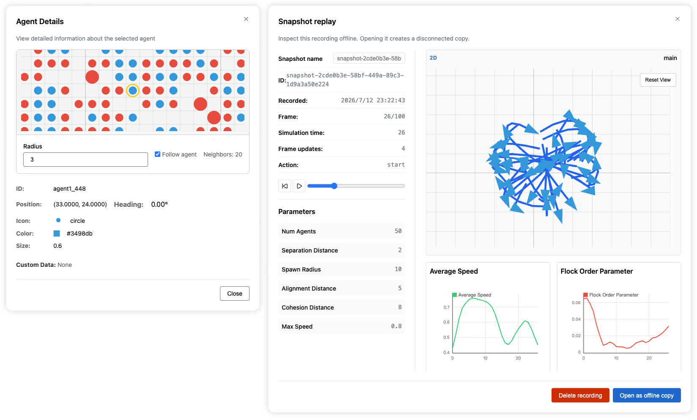

# TenSnap

**TenSnap** (short for "NetLogo Snapshot", with "Net" reversed) is an open-source interactive visualization toolkit for agent-based modeling and simulation (ABM&S). It combines NetLogo's immediacy in visualization with the flexibility and power of modern programming ecosystems.

## ✨ Features

- **🎨 Interactive Visualization**: Real-time visualization of agent-based simulations with immediate feedback
- **🌐 Language Agnostic**: Connect simulations written in Python, Go, JavaScript/TypeScript, Julia, or directly against the protocol
- **⚡ Modern Web Interface**: Built with React for a responsive, feature-rich user experience
- **🎛️ NetLogo-Inspired UI**: Familiar controls (sliders, buttons, charts) with modern enhancements
- **🔧 Multi-Granularity APIs**: From simple high-level APIs for beginners to low-level protocol access for experts
- **💻 Dual Deployment**: Run in browser or as desktop app via Tauri
- **🌍 Internationalization**: Full i18n support with English, Chinese, and Japanese languages




## 🚀 Quick Start

### Installation

Installing Python bindings from PyPI:

```bash
pip install tensnap
```

Installing Python bindings from source code (for advanced users):

```bash
# Clone the repository
git clone https://github.com/billstark001/tensnap.git
cd tensnap

# Install Python bindings
cd packages/tensnap-python
pip install -e .

```

Installing Go bindings:

```bash
go get github.com/billstark001/tensnap/packages/tensnap-go@latest
```

Installing Julia bindings from this repository:

```julia
using Pkg
Pkg.develop(path="packages/tensnap-julia")
```

Installing Node.js dependencies for frontend development (for advanced users):

```bash

# Install JavaScript dependencies
pnpm install
```

### Run Your First Example

```bash
# Start web interface (in one terminal)
pnpm dev:web

# Run flocking simulation (in another terminal)
pnpm dev:py:flock

# Or run directly from the examples directory
cd examples/python
python flock_viz.py
```

For the Go example:

```bash
cd examples/go
make run-schelling
```

For JavaScript and Julia examples:

```bash
pnpm dev:js:schelling
pnpm run dev:julia:schelling
```

Then open your browser to `http://localhost:3200` and watch the agents interact!

- The [Netlify instance](https://tensnap.netlify.app) is also available at `https://tensnap.netlify.app`. You may access the site to avoid local deployment.

## 📚 Documentation

Comprehensive documentation is available in the `/docs` folder:

### For Users

- **[Getting Started](./docs/user-guide/getting-started.md)** - Quick introduction and first steps
- **[Installation Guide](./docs/user-guide/installation.md)** - Detailed installation instructions
- **[User Guide](./docs/user-guide/user-guide.md)** - Complete guide to using TenSnap
- **[Tutorials](./docs/tutorials/)** - Runnable tutorials for Random Walk, Flocking, Predator-Prey, and Network Dynamics, with later chapters still planned
- **[Python API Reference](./docs/api-reference/python-api.md)** - Complete Python API documentation
- **[Go API Reference](./docs/api-reference/go-api.md)** - Go bindings, declarative Scenario API, and incremental diff helpers
- **[JavaScript API Reference](./docs/api-reference/js-api.md)** - TypeScript simulator bindings, sessions, and transports
- **[Julia API Reference](./docs/api-reference/julia-api.md)** - TenSnap.jl scenario, layer, asset, and transport helpers

### For Maintainers

- **[Architecture Overview](./docs/maintainer-guide/architecture.md)** - System architecture and design
- **[Development Setup](./docs/maintainer-guide/development-setup.md)** - Setting up development environment
- **[Contributing Guidelines](./docs/maintainer-guide/contributing.md)** - How to contribute to TenSnap
- **[Protocol Package](./packages/protocol/README.md)** - Source of truth for renderer/simulator schemas, codecs, and generated protocol documentation
- **[Internationalization (i18n)](./docs/maintainer-guide/i18n.md)** - Translation and localization guide

## 🎯 Design Philosophy

TenSnap aims to:

1. **Preserve NetLogo's Strengths**: Keep the rapid prototyping and interactive visualization that made NetLogo popular
2. **Embrace Modern Ecosystems**: Allow researchers to use their preferred programming languages and tools
3. **Separate Concerns**: Decouple model logic (any language) from visualization (TenSnap)
4. **Support All Skill Levels**: Provide intuitive APIs for newcomers and powerful tools for experts

## 📖 Example

Here's a simple agent-based model with TenSnap:

```python
import asyncio

from tensnap import (
    SimulationScenario,
    agent,
    agent_layer,
    chart,
    env,
    grid_layer,
    params,
)


@agent(x="position[0]", y="position[1]")
class Bird:
    def __init__(self, bird_id: int, position: tuple[int, int]):
        self.id = bird_id
        self.position = position


@grid_layer()
@agent_layer("birds")
@env(id="main")
class Aviary:
    def __init__(self):
        self.width = 20
        self.height = 10
        self.birds = [Bird(1, (2, 3)), Bird(2, (4, 5))]

    def step(self) -> None:
        for bird in self.birds:
            x, y = bird.position
            bird.position = (x + 1, y)

    @chart("population", "Population")
    def population(self) -> int:
        return len(self.birds)


@params(include=["speed"])
class Config:
    speed = 1.0


scenario = SimulationScenario(port=8765)
model = Aviary()
config = Config()

scenario.add_all(model)
scenario.add_all(config)


async def main() -> None:
    await scenario.register_model_handler(model_step=model.step)
    await scenario.run()


if __name__ == "__main__":
    asyncio.run(main())
```

## Notes on the Current Python Surface

- `SimulationScenario` is the recommended high-level Python runtime.
- `abm.Scenario` is the recommended declarative Go surface for simulator-visible state.
- `modelBuilder(...)` is the recommended JavaScript binding builder.
- `Scenario` plus explicit builders such as `parameter(...)`, `agents_layer(...)`, and `chart(...)` are the Julia binding surface.
- The current decorator and readback surface lives under `tensnap.bindings`.
- Binding decorators infer same-name item fields, layer sources, and layer metadata once per initialized instance; use selector strings only when the source path differs, such as `x="position[0]"`.
- Use `SimulationScenario.add_all(...)` for the common Python registration path. It registers environment/layer, chart, and action bindings by default; parameter discovery is opt-in through `@params(...)` or an explicit config.
- Built-in renderer-driven actions are `start`, `step`, and `reset`.
- Tutorial 1, Tutorial 2, Tutorial 3, and Tutorial 4 are now backed by runnable examples in `examples/python/`; tutorials 5-6 are still planned.

## Project Structure

TenSnap is organized as a monorepo:

```
tensnap/
├── benchmarks/                  # Versioned subjects, profiles, locks, and benchmark oracles
├── docs/                        # User and maintainer documentation
├── examples/                    # Runnable Go, Python, Julia, JavaScript, and Mesa examples
│   └── js/                      # Built-in JS examples, manifests, and local transports
├── packages/
│   ├── benchmark/               # Generic reproducible benchmark execution harness
│   ├── protocol/                # Protocol payload types, schemas, and codecs
│   ├── core/                    # Scenario, runtime, stores, and rendering primitives
│   ├── tensnap-agent/           # Headless shared-session host and automation CLI
│   ├── tensnap-go/              # Go protocol, ABM helpers, and WebSocket server
│   ├── tensnap-js/              # JavaScript/TypeScript simulator bindings and transports
│   ├── tensnap-julia/           # Julia bindings and WebSocket simulator server
│   ├── tensnap-python/          # Python bindings and server/runtime integration
│   ├── tensnap-tauri/           # Desktop wrapper around the web app
│   ├── tensnap-web/             # React renderer application
│   ├── web-adapter/             # Web-side filesystem and integration helpers
│   └── web-common/              # Shared UI/helpers for browser packages
└── scripts/                     # Release and asset maintenance scripts
```

### Package Responsibilities

- **protocol**: Renderer/simulator schemas, type definitions, codecs, built-in layer contracts, and generated protocol reference.
- **core**: Renderer-side `Scenario`, `RendererSession`, bounded `RunController`, condition evaluation, inspection/trajectory semantics, recording/replay, layer registry, rendering primitives, and `AssetStore`.
- **tensnap-web**: Main browser renderer, transport wiring, project UI (including offline recordings and content-addressed assets), and scenario store integration.
- **tensnap-tauri**: Desktop shell reusing the web renderer, with scoped native file access and app-data settings persistence.
- **tensnap-agent**: Headless host for the shared renderer session, HTTP/CLI bounded runs, and offscreen rendering utilities.
- **tensnap-go**: Go protocol package, declarative ABM helpers, and WebSocket simulator server.
- **tensnap-js**: TypeScript declarative simulator bindings, low-level sessions/emitters, and postMessage/WebSocket hosts.
- **tensnap-julia**: Julia binding builders, Agents.jl-compatible projectors, JSON/MessagePack WebSocket simulator server, incremental item diffing, and asset helpers.
- **tensnap-python**: Python binding/decorator surface plus server-side runtime helpers.
- **examples/js**: Built-in JavaScript models, example manifests, and WebSocket demo entrypoints.
- **web-common** / **web-adapter**: Shared browser-side UI, types, and filesystem integration.
- **benchmark**: Generic runner, journal/resume/merge workflow, artifact verification, statistical summaries, and analysis generation. Versioned subjects and publication profiles live in `benchmarks/`, outside user-facing examples.

Some Schelling example launchers are intentionally thin: visualization
entrypoints call reusable binding/UI factories and standalone entrypoints call
reusable study helpers. This split exists so examples and publication subjects
share model, reset and trial behavior; it is not extra structure required for a
normal TenSnap integration. See [`benchmarks/README.md`](benchmarks/README.md)
for the ownership boundary.

## 🤝 Contributing

We welcome contributions! Please see our [Contributing Guidelines](./docs/maintainer-guide/contributing.md) for details on:

- Reporting bugs
- Suggesting enhancements
- Submitting pull requests
- Code style and standards

## 📝 License

TenSnap is released under the [MIT License](./LICENSE).

## 🎓 Background

TenSnap was developed to address the gap between NetLogo's excellent interactive visualization and modern programming paradigms. While NetLogo excels at rapid prototyping and visualization, it lacks support for modern features like object-oriented programming, modularity, and asynchronous execution. TenSnap bridges this gap by:

- Providing NetLogo-style visualization for any programming language
- Supporting modern development practices
- Enabling scalable, industrial-strength simulations
- Maintaining the ease-of-use that makes NetLogo popular

## 🔗 Links

- **[Documentation](./docs/)** - Complete documentation
- **[Go Examples](./examples/go/)** - Go examples and simulator entry points
- **[JavaScript Examples](./examples/js/)** - JavaScript/TypeScript examples and local simulator entry points
- **[Julia Examples](./examples/julia/)** - Julia examples and simulator entry points
- **[Python Examples](./examples/python/)** - Standard Python examples
- **[Mesa Examples](./examples/python_mesa/)** - Mesa-based examples
- **[Issues](https://github.com/billstark001/tensnap/issues)** - Report bugs or request features
- **[Discussions](https://github.com/billstark001/tensnap/discussions)** - Ask questions and share ideas

## 🔗 Citation

TenSnap is built as an open-source initiative to bridge the gap between high-performance computational models and user-friendly visualization in social sciences.

If TenSnap has benefited your research—whether by facilitating your agent-based modeling process, aiding in the visualization and debugging of your simulations, or inspiring your methodological design—please consider citing our work. Citing the project not only acknowledges the effort behind its development but also helps us track its impact and secure support for future maintenance.

You can cite our IC2S2 2026 presentation as follows:

**Plain Text (APA):**
> Zhao, J., & Chen, Y. (2026). TenSnap: Bridging the Performance-Usability Gap in Computational Social Science Modeling via a Decoupled Interactive Protocol. Extended abstract presented at the International Conference on Computational Social Science (IC2S2 2026).

**BibTeX:**

```bibtex
@misc{zhao2026tensnap,
  title={TenSnap: Bridging the Performance-Usability Gap in Computational Social Science Modeling via a Decoupled Interactive Protocol},
  author={Zhao, Junning and Chen, Yu},
  howpublished={Parallel talk presented at the International Conference on Computational Social Science (IC2S2)},
  year={2026},
  note={Non-archival extended abstract}
}
```

(The paper was reviewed under the blinded name "OurFramework" and will be presented at IC2S2 2026)

## 🌟 Star History

If you find TenSnap useful, please consider giving it a star on GitHub!

---

**TenSnap** - Interactive visualization for agent-based modeling, reimagined.
